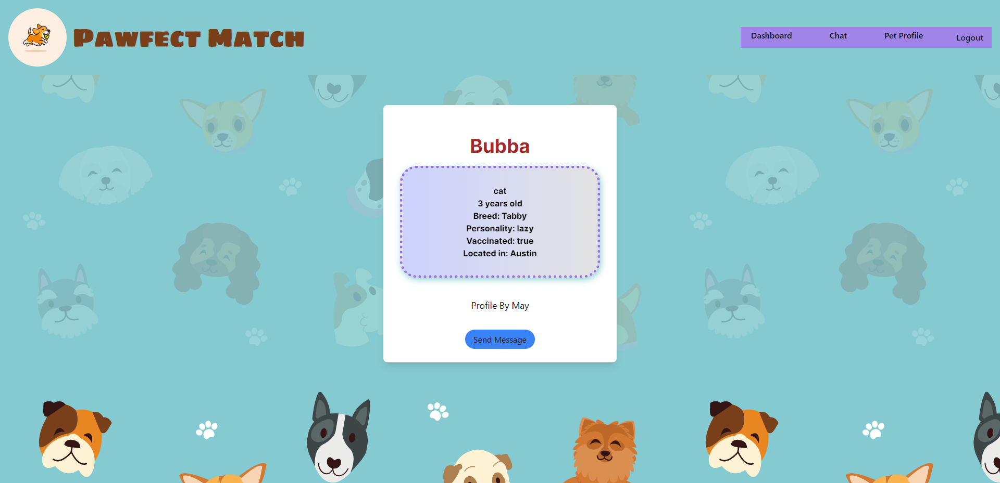
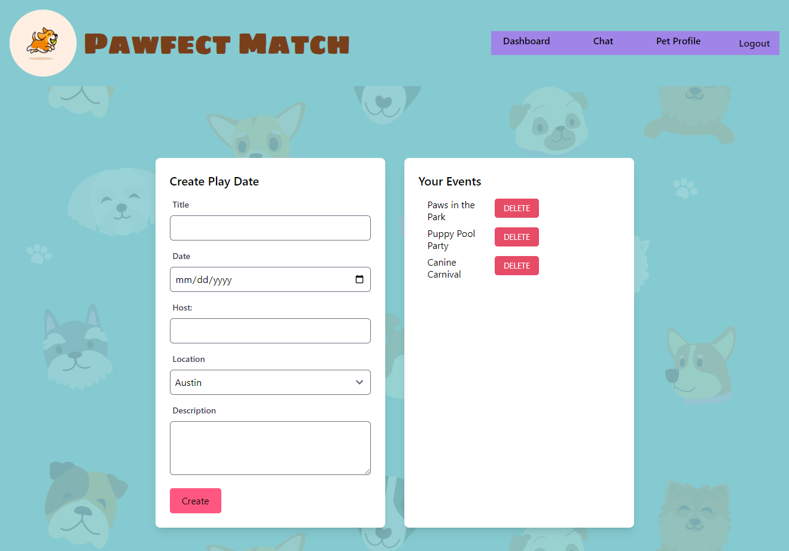
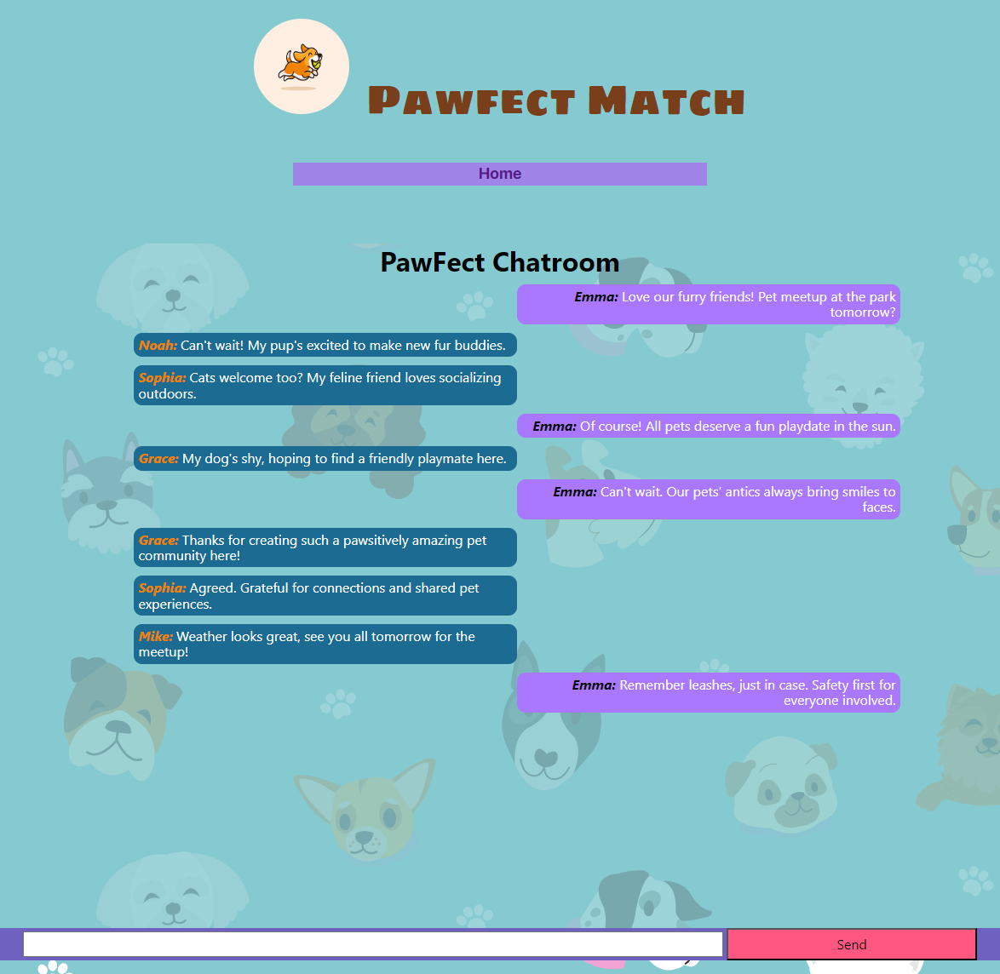
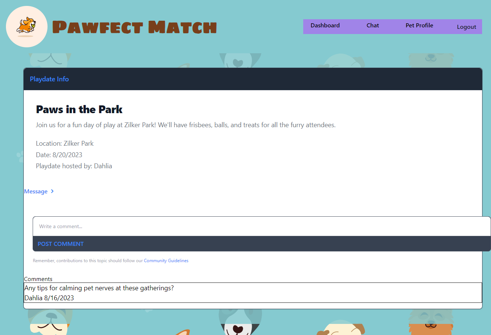

# PawfectMatch
> UT's Fullstack Flex Web Development Bootcamp - Project 2, Group 1: May, Dahlia, Tyson and Johnathan

[](https://opensource.org/licenses/MIT)

Pawfect Match is a web application built with Node.js, Express, MySQL, Sequelize, and Handlebars that allows pet owners to connect with others in their neighborhood to schedule playdates for their pets.

### [View the deployed application ➡️](https://desolate-journey-58009-31421c44a662.herokuapp.com/)

## Table of Contents
  * [Description](#description)
  * [Screenshots](#screenshots)
  * [Usage](#usage)
  * [Technologies](#technologies)
  * [Installation](#installation)
  * [Developed by](#developed-by)
  * [Contributing](#contributing)
  * [License](#license)

## Description
Pawfect Match is a web application that allows pet owners to connect with others in their neighborhood to schedule playdates for their pets.

Unlike mainstream social media, Pawfect Match provides a tailored platform for pet owners to foster community and simplify playdate coordination.

Users can create a profile for their pet with photos, personality traits, and activity preferences. They can then browse other local pet profiles and request playdates that work for both pet owners' schedules.

The app uses real-time chat to coordinate the details of each playdate. Pet owners can also create public meetup events inviting all app members.

Pawfect Match aims to help pet owners enrich their pets' lives through socialization while building meaningful relationships with their neighbors.


## Screenshots





## Usage
The Pawfect Match app allows users to:

- Create an account
- Add profiles for their pets with photos and details
- Post public playdate events for all app members
- Chat in real-time to coordinate logistics

## Built With


- Nodejs
- Express
- MySQL
- Sequelize ORM
- Handlebars Templating
- Tailwind CSS
- Firebase Realtime Database (for chat)
- Multer (for image upload)
- BCrypt (for password hashing)
- App deployed with Heroku


## Installation

To use this app locally, clone the repository and install required dependencies:
```
git clone https://github.com/mayphamx/PawfectMatch.git
cd pawfectmatch
npm install
```

Create a ```.env``` file with your MySQL credentials and database details.
Run the schema file to set up the database locally.

```
mysql -u root -p 

< SOURCE db/schema.sql
```

Optionally seed the database:
```
npm run seed
```
Start the application:
```
npm start
```
The app will be available at http://localhost:3001

<br>

## Developed by:
- May Pham https://github.com/mayphamx
- Dahlia Guido https://github.com/CypherNyx
- Tyson Starks https://github.com/Starkoiii
- Jonathan Gutierrez

## Contributing
Pull requests are welcome. Please open an issue first to discuss any proposed changes or additions.
<br>

### License
[](https://opensource.org/licenses/MIT)
  
  https://opensource.org/licenses/MIT <br> 
  This project is open source and available under the MIT License.